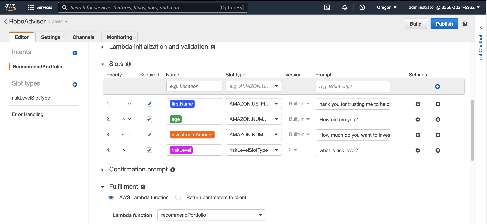
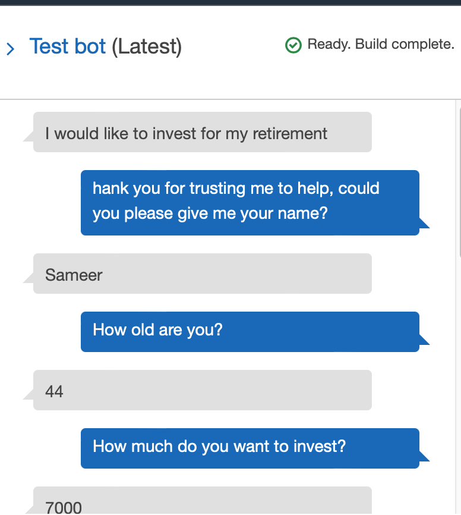
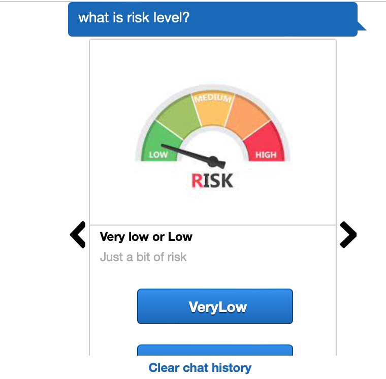
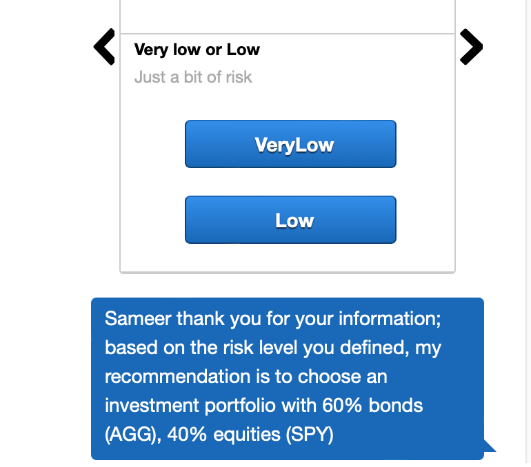
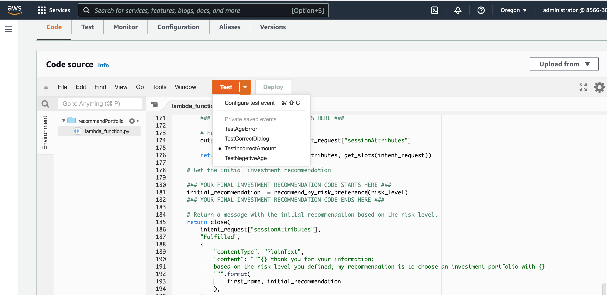
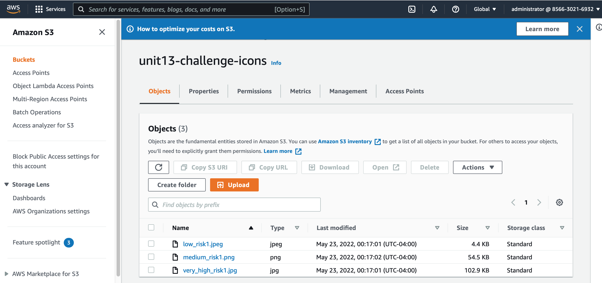

# unit13-challenge
### Robo Advisor for Retirement Plans - Create a robo advisor that could be used by customers or potential new customers to get investment portfolio recommendations for retirement.  Use Amazon Web Services with Python to create a bot that will recommend an investment portfolio for a retirement plan

- Defined an Amazon Lex bot with a single intent that establishes a conversation about the requirements to suggest an investment portfolio for retirement.
- Built and Testes the Robo Advisor: Verified that the bot is working and responding accurately along with the conversation with the user, by building and testing it.
- Enhanced the Robo Advisor with an Amazon Lambda Function: 
- Created an Amazon Lambda function that validates the user's input and returns the investment portfolio recommendation. 
- Tested the Amazon Lambda function and making the integration with the bot.

***The screen recording RoboAdvisor_Recording.mov shows how the bot validates incorrect data and shows the recommendation when all required data is provided***

Below screenshots indicate how RoboAdvisor was configured and tested.

***Configuring RoboAdvisor***

***Testing RoboAdvisor - providing inputs of age/investment amount***

***Testing RoboAdvisor - choosing risk profile***

***Testing RoboAdvisor - output***

***Testing Lambda function***

***Using Icons uploaded in S3 bucket***

[Reference-Icons downloaded from iconfinder.com](https://www.iconfinder.com)

